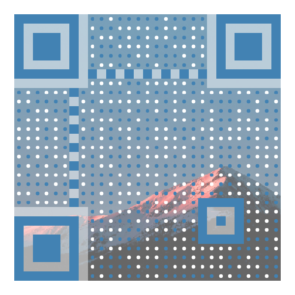
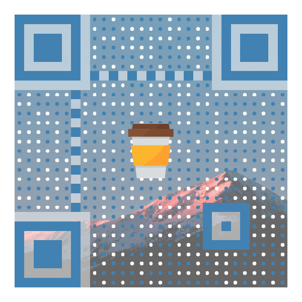
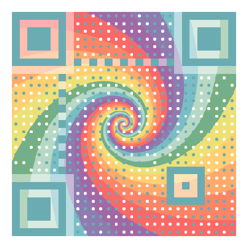

QRGen - QR Generator

## Showcase

No Logo|With Logo|Animated GIF
------------ | ------------- | -------------
 |  |  

> Listing only several styles for demonstration. 
>
> Find out more styles and options in the Awesome QR app!

## Installation

To add the dependency into your project, edit your project-level *build.gradle* first.

```
allprojects {
    repositories {
        ...
        maven { url 'https://jitpack.io' }
    }
}
```

Then, edit your *build.gradle* on module level.

> Remember to replace `<LATEST_VERSION_NAME>` with the latest version name showed on the JitPack badge.

```
dependencies {
    implementation 'com.github.SumiMakito:AwesomeQRCode:<LATEST_VERSION_NAME>'
}
```

## Usage

### 1. Say hello to *RenderOption*.

Like a recipe, *RenderOption* stores a set of options and it will tell the renderer "how to stylize the QR code for you."

```kotlin
// Kotlin

val renderOption = RenderOption()
renderOption.content = "Special, thus awesome." // content to encode
renderOption.size = 800 // size of the final QR code image
renderOption.borderWidth = 20 // width of the empty space around the QR code 
renderOption.ecl = ErrorCorrectionLevel.M // (optional) specify an error correction level
renderOption.patternScale = 0.35f // (optional) specify a scale for patterns
renderOption.roundedPatterns = true // (optional) if true, blocks will be drawn as dots instead
renderOption.clearBorder = true // if set to true, the background will NOT be drawn on the border area
renderOption.color = color // set a color palette for the QR code
renderOption.background = background // set a background, keep reading to find more about it
renderOption.logo = logo // set a logo, keep reading to find more about it
```

```java
// Java

RenderOption renderOption = new RenderOption();
renderOption.setContent("Special, thus awesome."); // content to encode
renderOption.setSize(800); // size of the final QR code image
renderOption.setBorderWidth(20); // width of the empty space around the QR code
renderOption.setEcl(ErrorCorrectionLevel.M); // (optional) specify an error correction level
renderOption.setPatternScale(0.35f); // (optional) specify a scale for patterns
renderOption.setRoundedPatterns(true); // (optional) if true, blocks will be drawn as dots instead
renderOption.setClearBorder(true); // if set to true, the background will NOT be drawn on the border area
renderOption.setColor(color); // set a color palette for the QR code
renderOption.setBackground(background); // set a background, keep reading to find more about it
renderOption.setLogo(logo); // set a logo, keep reading to find more about it
```

> But, wait. What is a *background*? Don't worry and keep reading. :)

### 2. Grab a background.<sup>Optional</sup>

Awesome QR code natively provides three types of backgrounds. Each background should extend the abstract *Background* class.

```kotlin
// Kotlin

// A still background (a still image as the background)
val background = StillBackground()
background.bitmap = backgroundBitmap // assign a bitmap as the background
background.clippingRect = Rect(0, 0, 200, 200) // crop the background before applying
background.alpha = 0.7f // alpha of the background to be drawn

// A blend background (to draw a QR code onto an area of a still image)
val background = BlendBackground()
background.bitmap = backgroundBitmap
background.clippingRect = Rect(0, 0, 200, 200)
background.alpha = 0.7f
background.borderRadius = 10 // radius for blending corners

// A gif background (animated)
val background = GifBackground()
background.inputFile = gifFile // assign a file object of a gif image to this field
background.outputFile = File(pictureStorage, "output.gif") // IMPORTANT: the output image will be saved to this file object
background.clippingRect = Rect(0, 0, 200, 200)
background.alpha = 0.7f
```

```java
// Java

// A still background (a still image as the background)
StillBackground background = new StillBackground(); 
background.setBitmap(backgroundBitmap); // assign a bitmap as the background
background.setClippingRect(new Rect(0, 0, 200, 200));// crop the background before 
background.setAlpha(0.7f); // alpha of the background to be drawn

// A blend background (to draw a QR code onto an area of a still image)
BlendBackground background = new BlendBackground();
background.setBitmap(backgroundBitmap);
background.setClippingRect(new Rect(0, 0, 200, 200));
background.setAlpha(0.7f);
background.setBorderRadius(10); // radius for blending corners

// A gif background (animated)
GifBackground background = new GifBackground();
background.setInputFile(gifFile); // assign a file object of a gif image to this field
background.setOutputFile(new File(pictureStorage, "output.gif")); // IMPORTANT: the output image will be saved to this file object
background.setClippingRect(new Rect(0, 0, 200, 200));
background.setAlpha(0.7f);
```

### 3. Seek for a rainbow.<sup>Optional</sup>

> This step is optional since Awesome QR code will use black and white as the default color set.

```kotlin
// Kotlin

val color = Color()
color.light = 0xFFFFFFFF.toInt() // for blank spaces
color.dark = 0xFFFF8C8C.toInt() // for non-blank spaces
color.background = 0xFFFFFFFF.toInt() // for the background (will be overriden by background images, if set)
color.auto = false // set to true to automatically pick out colors from the background image (will only work if background image is present)
```

```java
// Java

Color color = new Color(); 
color.setLight(0xFFFFFFFF); // for blank spaces
color.setDark(0xFFFF8C8C); // for non-blank spaces
color.setBackground(0xFFFFFFFF); // for the background (will be overriden by background images, if set)
color.setAuto(false); // set to true to automatically pick out colors from the background image (will only work if background image is present)
```

### 4. Hey. I want a Logo.<sup>Optional</sup>

> This step is optional since the logo is not required by default.

```kotlin
// Kotlin

val logo = Logo()
logo.bitmap = logoBitmap
logo.borderRadius = 10 // radius for logo's corners
logo.borderWidth = 10 // width of the border to be added around the logo
logo.scale = 0.3f // scale for the logo in the QR code
logo.clippingRect = Rect(0, 0, 200, 200) // crop the logo image before applying it to the QR code
```

```java
// Java

Logo logo = new Logo();
logo.setBitmap(logoBitmap);
logo.setBorderRadius(10); // radius for logo's corners
logo.setBorderWidth(10); // width of the border to be added around the logo
logo.setScale(0.3f); // scale for the logo in the QR code
logo.setClippingRect(new Rect(0, 0, 200, 200)); // crop the logo image before applying it to the QR code
```

### 5. Render!

Meet the magical renderer.

##### If you prefer the asynchronous way...

```kotlin
// Kotlin

val result = AwesomeQrRenderer.renderAsync(renderOption, { result ->
    if (result.bitmap != null) {
        // play with the bitmap
    } else if (result.type == RenderResult.OutputType.GIF) {
        // If your Background is a GifBackground, the image 
        // will be saved to the output file set in GifBackground
        // instead of being returned here. As a result, the 
        // result.bitmap will be null.
    } else {
        // Oops, something gone wrong.
    }
}, { 
    exception -> exception.printStackTrace() 
    // Oops, something gone wrong.
})
```

##### Or synchronously...

```kotlin
// Kotlin

try {
    val result = AwesomeQrRenderer.render(renderOption)
    if (result.bitmap != null) {
        // play with the bitmap
    } else if (result.type == RenderResult.OutputType.GIF) {
        // If your Background is a GifBackground, the image 
        // will be saved to the output file set in GifBackground
        // instead of being returned here. As a result, the 
        // result.bitmap will be null.
    } else {
        // Oops, something gone wrong.
    }
} catch (e: Exception) {
    e.printStackTrace()
    // Oops, something gone wrong.
}
```

## Changelog

#### Version 1.2.0

- Translated into Kotlin.
- Changed to the RenderOption-Renderer structure.

#### Version 1.1.1

- Fixed a bug that would previously cause the gaps between blocks in position/alignment patterns.

#### Version 1.1.0

+ Added the support for GIF backgrounds.
+ Fixed some issues found in the previous version.

#### Version 1.0.6

- Fixed a "divide by zero" error mentioned in [#20](https://github.com/SumiMakito/AwesomeQRCode/issues/20).

#### Version 1.0.5
- The way to use Awesome QR code is more elegant.

#### Version 1.0.4

- New feature: Embedding a logo image in the QR code.
- Sample/Demo application updated.

#### Version 1.0.3

- Added CHARACTER_SET => UTF-8 to QR code's hints before encoding.
- Fixed an encoding issue mentioned in [#7](https://github.com/SumiMakito/AwesomeQRCode/issues/7).

#### Version 1.0.2

- Added an optional parameter which enables the data dots to appear as filled circles.

#### Version 1.0.1

- Now background images can be binarized as you like.

#### Version 1.0.0

- Initial release.
